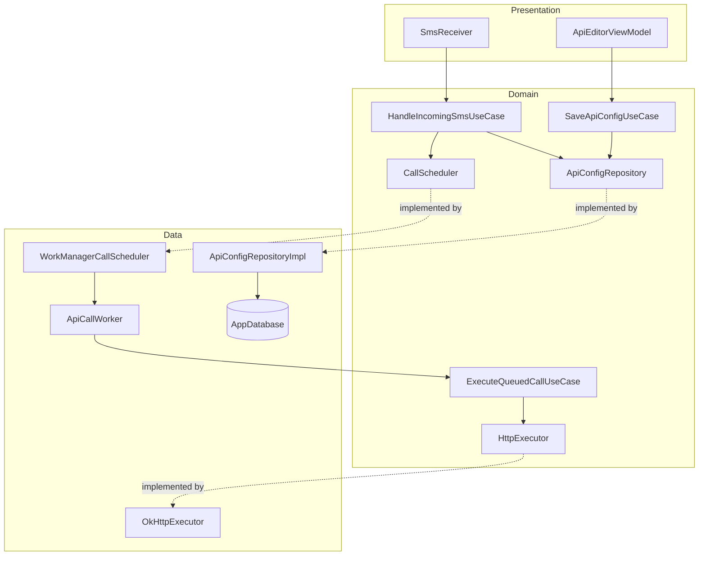
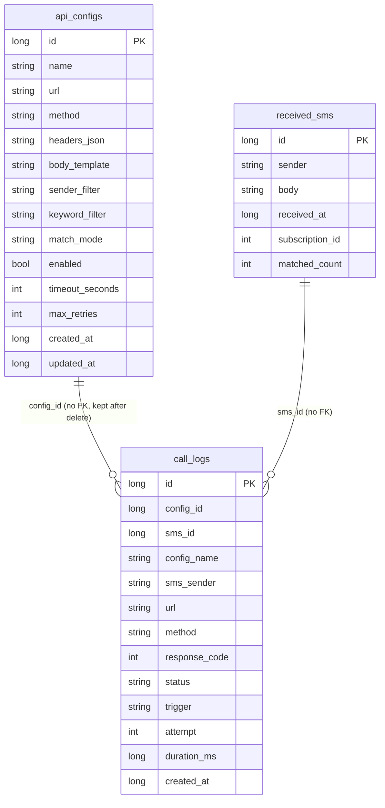

# SMS Hook

| | |
|---|---|
| Overview | Android app that calls user-configured HTTP APIs whenever an incoming SMS matches a rule, built to run unattended in the background |
| Last edit | 2026-10-04 |
| Author | Dam Hong Duc |

## Store links

| Platform | Link |
|---|---|
| Google Play | Not published |

## App IDs

| ID | Value |
|---|---|
| Android applicationId | `com.dd.sms.hook` |
| Android namespace | `com.dd.sms.hook` |

## Tech stack

| Category | Technology | Version |
|---|---|---|
| Framework | Native Android, Jetpack Compose (BOM) + Material 3 | 2026.09.00 |
| Language | Kotlin | 2.4.20 |
| State management | ViewModel + StateFlow (AndroidX Lifecycle) | 2.11.0 |
| Backend | None (calls user-configured webhooks) | - |
| Local DB | Room | 2.8.5 |
| Notable libraries | WorkManager (durable, retrying API calls) | 2.12.0 |

## Project architecture

| | |
|---|---|
| Pattern | Clean Architecture + MVVM, feature-first |
| Encryption | No |



### Project structure

```text
app/src/main/java/com/dd/sms/hook/
├── App.kt                              # @HiltAndroidApp → AppBootstrap
├── MainActivity.kt                     # root View: theme, locale, AppRoot
├── MainViewModel.kt                    # root ViewModel: settings state
├── bootstrap/            AppBootstrap
├── navigation/           Routes (@Serializable), AppRoot (NavHost)
│
├── shared/                                         # no business owner, never imports features/
│   ├── presentation/
│   │   ├── ui/           ScreenScaffold, Cards, Chips, Dialogs, SwitchRow, IconBadge,
│   │   │                 StateViews, AppMessenger, MessageEffect, UiMessage, UiFormat…
│   │   ├── theme/        Color, Dimens, Shape, Theme, Type
│   │   ├── locale/       AppLanguage
│   │   └── permission/   PermissionRequester, PermissionState, PermissionUtils
│   ├── domain/
│   │   ├── time/         TimeUtils
│   │   ├── constants/    AppConstants
│   │   └── logging/      AppLogger
│   └── data/
│       ├── db/           AppDatabase
│       ├── serialization/ AppJson
│       └── di/           CoreModule (Room, OkHttp, WorkManager, DataStore)
│
└── features/
    ├── apiconfig/                                  # API configs (api_configs)
    │   ├── presentation/
    │   │   ├── list/         ApiListScreen · ApiListViewModel
    │   │   └── editor/       ApiEditorScreen, EditorSections, TestCallDialog · ApiEditorViewModel
    │   ├── domain/
    │   │   ├── model/        ApiConfig, ApiConfigDefaults
    │   │   ├── repository/   ApiConfigRepository
    │   │   ├── service/      ApiConfigValidator
    │   │   └── usecase/      ApiConfigUseCases
    │   ├── data/
    │   │   ├── local/        ApiConfigEntity, ApiConfigDao, ApiConfigMapper
    │   │   └── repository/   ApiConfigRepositoryImpl
    │   └── di/               ApiConfigModule
    │
    ├── calllog/                                    # call history (call_logs)
    │   ├── presentation/
    │   │   ├── list/         HistoryScreen · HistoryViewModel
    │   │   ├── detail/       CallDetailScreen, DeliveryTimeline · CallDetailViewModel
    │   │   └── components/   CallLogRow
    │   ├── domain/
    │   │   ├── model/        CallLog, CallStats
    │   │   ├── repository/   CallLogRepository
    │   │   └── usecase/      CallLogUseCases
    │   ├── data/
    │   │   ├── local/        CallLogEntity, CallLogDao, CallLogMapper
    │   │   └── repository/   CallLogRepositoryImpl
    │   └── di/               CallLogModule
    │
    ├── dispatch/                                   # SMS → match → HTTP call (received_sms)
    │   ├── domain/
    │   │   ├── model/        DispatchModels
    │   │   ├── repository/   ReceivedSmsRepository
    │   │   ├── service/      SmsMatcher, TemplateRenderer, RequestFactory, DispatchContracts
    │   │   └── usecase/      HandleIncomingSmsUseCase, ExecuteQueuedCallUseCase,
    │   │                     CallExecution, DispatchUseCases
    │   ├── data/
    │   │   ├── local/        ReceivedSmsEntity, ReceivedSmsDao
    │   │   ├── remote/       OkHttpExecutor
    │   │   ├── work/         WorkManagerCallScheduler, ApiCallWorker, LogCleanupWorker
    │   │   └── repository/   ReceivedSmsRepositoryImpl
    │   ├── platform/         SmsReceiver, BootReceiver, KeepAliveService,
    │   │                     AndroidKeepAliveController, NotificationHelper
    │   └── di/               DispatchModule
    │
    ├── dashboard/                                  # stats, reads other features' domain
    │   ├── presentation/     DashboardScreen · DashboardViewModel
    │   │   └── components/   CallsBarChart, DashboardWidgets, GettingStartedCard, StatusHeroCard
    │   └── domain/
    │       ├── model/        DashboardData
    │       ├── service/      DailyAggregator
    │       └── usecase/      ObserveDashboardUseCase
    │
    └── settings/                                   # app settings (DataStore)
        ├── presentation/     SettingsScreen, AppearanceSection · SettingsViewModel
        ├── domain/
        │   ├── model/        AppSettings
        │   ├── repository/   SettingsRepository
        │   └── usecase/      SettingsUseCases
        ├── data/
        │   └── repository/   SettingsRepositoryImpl
        └── di/               SettingsModule
```

## Local database


