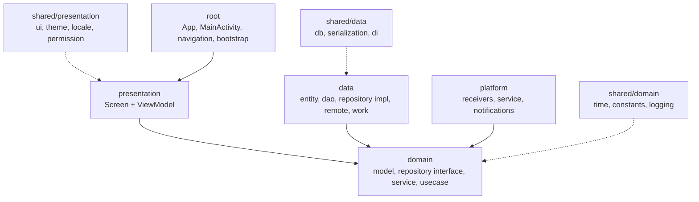
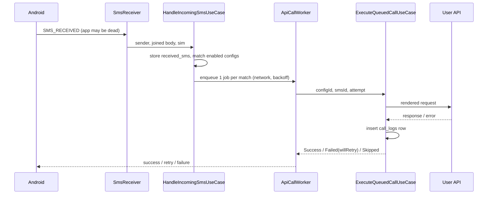

# Architecture

## Layers

| Layer | Folder | Responsibility | May depend on |
|---|---|---|---|
| presentation | `features/<f>/presentation/` | Compose screens, ViewModels (`StateFlow` state, `Channel` one-shot events) | own domain, other features' domain, `shared/presentation`, `shared/domain` |
| domain | `features/<f>/domain/` | Pure Kotlin models, repository interfaces, services, use cases | other features' domain, `shared/domain` |
| data | `features/<f>/data/` | Room entities/DAOs, repository impls, OkHttp, WorkManager | own domain, other features' domain, `shared/domain`, `shared/data` |
| platform | `features/dispatch/platform/` | `SmsReceiver`, `BootReceiver`, `KeepAliveService`, `NotificationHelper` | domain, `shared/domain`, `shared/data` |
| di | `features/<f>/di/`, `shared/data/di/` | Hilt modules binding interfaces to impls | all |
| shared | `shared/{presentation,domain,data}/` | Cross-cutting code with no business owner, split by the layer that uses it | nothing in `features/` except `shared/data/db` listing entities |
| root | `App.kt`, `MainActivity.kt`, `MainViewModel.kt`, `navigation/`, `bootstrap/` | Wiring that knows every feature | all |

## Features

| Feature | Owns | Screens |
|---|---|---|
| `apiconfig` | `api_configs` table, validation, CRUD | API list, API editor |
| `calllog` | `call_logs` table, stats queries | History, Call detail |
| `dispatch` | `received_sms` table, matching, templating, HTTP, workers, receivers, keep-alive service | - |
| `dashboard` | Stats aggregation (no table) | Dashboard |
| `settings` | DataStore settings | Settings |
| `devtools` | Demo data for dev builds (no table, uses other features' repositories) | Developer section in Settings (dev flavor only) |

## Data flow: SMS to API call

## Key decisions

| Decision | Reason | Trade-off |
|---|---|---|
| Manifest-declared `SmsReceiver` | Delivered even when the process is dead | Needs `RECEIVE_SMS` runtime permission |
| WorkManager job per matched API | Survives process death and reboot, waits for network, backoff | Calls are not strictly instant under Doze |
| Optional foreground service | Some OEMs kill background apps | Persistent notification |
| `call_logs` stores snapshots, no FK | History survives config deletion | Denormalised columns |
| One `call_logs` row per attempt | Shows every retry | Stats count attempts, not SMS |
| OkHttp directly, no Retrofit | URL/method/headers are fully dynamic | Manual request building |
| Teal/orange status colours | Pass colour-vision-deficiency check | Not the usual green/red |
| Cleartext HTTP allowed | LAN webhooks | No transport security for `http://` URLs |
| `dev` / `prod` flavors, each with its own env file and applicationId | Test a dev build on the same phone as the real one; dev is tagged on every screen | Two variants to build and test |
| `MainActivity` extends `AppCompatActivity` | In-app language switching on Android 12 and below | AppCompat dependency and `Theme.AppCompat` window theme |
| Theme mode stored in DataStore, applied in `MainActivity` | Light/dark independent of the device setting | Splash window follows the device theme, not the app one |

## Where to add things

| Task | Location |
|---|---|
| New screen | `features/<f>/presentation/<screen>/` + route in [Routes.kt](../app/src/main/java/com/dd/sms/hook/navigation/Routes.kt) + `composable<>` in [AppRoot.kt](../app/src/main/java/com/dd/sms/hook/navigation/AppRoot.kt) |
| New use case | `features/<f>/domain/usecase/` (`@Inject constructor`, `operator fun invoke`) |
| New DB table | Entity + DAO in `features/<f>/data/local/`, register in [AppDatabase.kt](../app/src/main/java/com/dd/sms/hook/shared/data/db/AppDatabase.kt), bump `version`, add migration |
| New setting | [AppSettings.kt](../app/src/main/java/com/dd/sms/hook/features/settings/domain/model/AppSettings.kt) + key in [SettingsRepositoryImpl.kt](../app/src/main/java/com/dd/sms/hook/features/settings/data/repository/SettingsRepositoryImpl.kt) |
| New placeholder | [TemplateRenderer.kt](../app/src/main/java/com/dd/sms/hook/features/dispatch/domain/service/TemplateRenderer.kt) `TemplateVariables` + [RequestFactory.kt](../app/src/main/java/com/dd/sms/hook/features/dispatch/domain/service/RequestFactory.kt) + description string |
| New constant | [AppConstants.kt](../app/src/main/java/com/dd/sms/hook/shared/domain/constants/AppConstants.kt) (cross-feature) or the feature's own file |
| New spacing / colour | [Dimens.kt](../app/src/main/java/com/dd/sms/hook/shared/presentation/theme/Dimens.kt) / [Color.kt](../app/src/main/java/com/dd/sms/hook/shared/presentation/theme/Color.kt) |
| New string | Every `values*/strings.xml`: `values`, `values-vi`, `values-zh-rCN`, `values-es`, `values-hi`, `values-ar` |
| New language | `values-<tag>/strings.xml` + entry in [AppLanguage.kt](../app/src/main/java/com/dd/sms/hook/shared/presentation/locale/AppLanguage.kt) |
